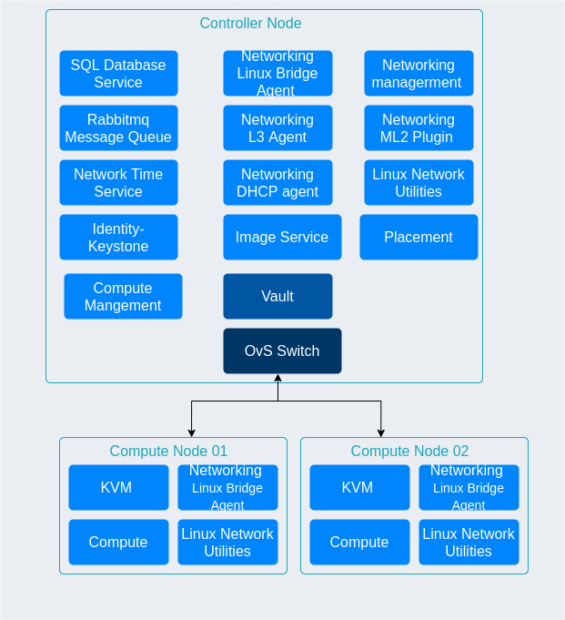

# Openstack-Homelab 
 

An Openstack deployment on a couple of [NUCs](https://www.intel.com/content/www/us/en/products/details/nuc/mini-pcs.html) and an old Dell Inspiron laptop. 
 

## TLDR 
* Improve knowledge about different distributed systems
* Openstack has an active community and plenty of resources to setup and maintain
* This a testbed for DevOps and SRE practices

 

## non-TLDR version
I have a keen interest in distributed systems. Given a system, I am quite interested in understanding: 
* Algorithms it uses e.g Raft for consensus 
* Components it relies on e.g Zookeeper for storing state or even NTP for clock sync
* The assumptions made e.g data will be eventually consistent
*How does its performance compare under load
In short: I want to know how and why things work. 

Openstack being Open Source and an active community behind it, makes it easier to setup and maintain the cluster. It was a great learning experience setting up the networking components and how it leverages Linux network stack. Also, how similar approaches can be found on projects like Kubernetes (some implementations) [e.g iptables](#iptables_ref). This Furthermore, many tools support it e.g Terraform and Ansible

I work in the DevOps/SRE space, this Openstack cluster will be a testbed for tools and workflows e.g apply CI/CD to Infrastructure code. Moreover, I want to improve my development skills by building and running simple, tried- tested map-reduce to consensus algorithms like Raft.

So having a testbed completely under my control is quite enticing. The same could be achieved on cloud, but long term it might be more expensive.  

 

# Architecture 
_This project is work in progress._
 
## Goals 

I wanted to leverage Infrastructure as Code(IaC) as much as possible for few reasons: 
* Make it easy clear everything and build up from scratch 
* To reflect upon some of the issues that might arise with apply IaC principles in a collaborative setting

## Overview 

Having said that here’s the brief overview of the deployment:
* Ansible playbooks are used to deploy the Openstack components and these are based on the [Openstack Installation Guide](https://docs.openstack.org/install-guide/). 
* The secrets (e.g API keys, Database passwords etc) are stored on [Hashicorp Vault](https://www.vaultproject.io/)

*fig: Based on [install guide](https://docs.openstack.org/install-guide/overview.html#example-architecture)*

 
The compute nodes are connected to controller via USB ethernet adaptor  [OVS](https://www.openvswitch.org/)

## Provisioning - Terraform and ansible 
Ansible Playbooks are used to deploy the Openstack and Vault. The playbooks follow [Openstack Installation Guide](https://docs.openstack.org/install-guide/) 

Terraform is being used to configure Vault and also to create VMs and networks on the cluster.

_More details to come_

## Secret management - [Hashicorp Vault](https://www.vaultproject.io/)
Multiple [approles](https://www.vaultproject.io/docs/auth/approle) are used to limit access. Configuration can be found openstack_setup/terraform_config/bastion_server_vault

_More details to come_
 

# References 

1. <a name="iptables_ref"> [Life of a Packet [I] - Michael Rubin, Google](https://www.youtube.com/watch?v=0Omvgd7Hg1I) and [I Can't Ping My VM! Learn How to Debug Neutron and Solve Common Problems](https://www.youtube.com/watch?v=aNA8Pvewu2M)</a>

 
